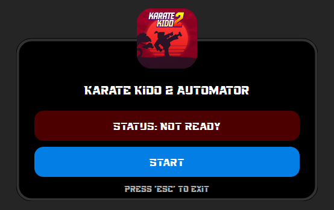

# Karate Kido 2 Automation


## I. Overview

Karate Kido 2 Automation is a computer vision-based automation tool designed to efficiently interact with the game "Karate Kido 2." It uses advanced techniques such as ORB feature detection and template matching to recognize game elements and automate gameplay actions. The tool features a **GUI** for real-time status updates and ensures **high performance and accuracy**.

## II. Features

- **Computer Vision Automation:** Uses ORB and template matching for accurate game state detection.
- **Graphical User Interface (GUI):** Displays real-time game status, automation state, and controls.
- **Performance Optimization:** Implements multithreading for fast and efficient processing.
- **Automation Control:** Start/stop automation with ease.
- **Keyboard Shortcuts:** Quickly toggle automation features.

## III. Installation

### 1. Running the Application

```bash
python main.py
```

### 2. Controls

- **Start Automation:** Press the start button in the GUI.
- **Stop Automation:** press 'q' to stop automating.
- **Keyboard Shortcut:** Assignable hotkeys for toggling automation.

## IV. Screenshots

### 1. Running the App

### 2. The GUI


## V. How It Works

1. Captures the game screen using **MSS** for minimal overhead.
2. Processes the image using **OpenCV** for feature detection.
3. Matches templates using ORB to recognize key elements.
4. Sends keyboard/mouse inputs using **PyAutoGUI** for gameplay automation.

## VI. Contributing

If you want to contribute, feel free to submit a pull request or report issues.

## 📜 License

This project is open-source under the MIT License.

